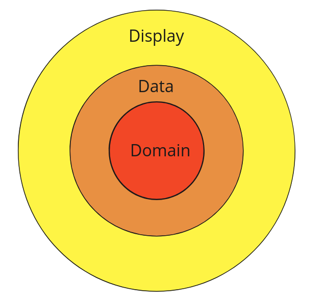

# random_activities

A new Flutter project with **Clean Architecture** 

## Domain-Data-Display

## Clean architecture

Features are divided into sun-folders of **features** folder. **domain** is fundation and it is solid. **data** is around the structure. **display** folder is about the visual of application. 

In features, it uses the structure of **domain**, **data**, and **display**. 

**domain** folder has **entities**, **repositories** and **usecases** folders.

**domain-entities** is the data structure from external source, an api. **domain-usecases** is the use of domain-repositories. **domain-repositories** is the bridget between domain and data. data-repositories implements it.

**data-repositories** communicate with **domain-repositories**. **data-models** is similar to **domain-entities**, but **data-models** can be more specific and be added more attributes. **data-datasources** is data from the Internet and data from the local phone.

**display** folder is about the visual of application. 

## Reference

The folder is referenced from [flutter mapp Hero to Pro](https://courses.fluttermapp.com/p/the-complete-flutter-course-hero-to-pro?coupon_code=PRESALE)
